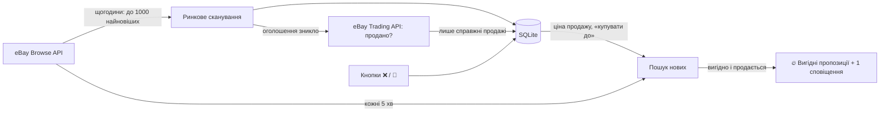

# 🛒 eBay Flip Bot

[](https://github.com/Taras-777/eBay_Flip_Bot/actions/workflows/ci.yml)


Telegram-бот для перепродажу на **eBay.de**. Він стежить за ринком товарів,
рахує реальну ціну продажу за **справжніми продажами** і повідомляє лише про
ті оголошення, на яких після комісії eBay і доставки лишається прибуток.

> eBay показує всі нові оголошення підряд. Бот показує тільки вигідні — і
> пояснює, скільки на них можна заробити і як швидко такий товар продається.

---

## ✨ Можливості

### Пошук вигідного
| | |
|---|---|
| 🔥 **Вигідні пропозиції** | усі знахідки — на окремому екрані з лічильником 🆕 у меню; у чат приходить одне коротке сповіщення на пачку, а не потік повідомлень; кожні 30 хв і при відкритті бот перевіряє, чи лот ще продається — продані й зняті зникають самі |
| 💰 **Реальний прибуток** | «купувати до» = ціна продажу − комісія eBay − доставка − мінімальний прибуток (15 €) |
| 🛒 **Як продаються такі ж** | у кожній пропозиції: скільки таких продано, за якою ціною і за скільки днів |
| 🐢 **Без «мертвого» товару** | конфігурації, які при живому ринку не продаються, не пропонуються |
| 📉 **Падіння цін** | попередження, якщо типова ціна групи за тиждень впала на 8 %+ |
| 🔻 **Зниження ціни** | повторне сповіщення, якщо продавець ще знизив ціну |

### Аналітика ринку
| | |
|---|---|
| 📊 **Ціна за конфігурацією** | окремо для нових / вживаних і для кожної конфігурації (256GB ≠ 512GB, i5 ≠ i7) |
| ✅ **Справжні продажі** | зникле оголошення перевіряється через eBay Trading API: продано, знято чи ще продається — у статистику йдуть лише продажі |
| 📈 **Продажі** | екран по товару: кількість, ціни, швидкість продажу за конфігураціями, список продажів; чужий товар прибирається кнопкою ❌ |
| 👁 **Спостереження** | у картці товару: скільки оголошень відстежується, скільки продано, скільки чекає перевірки |
| 💡 **Що перепродавати** | бот сам аналізує ~90 популярних товарів і ранжує, на чому найреальніше заробити |
| 🔍 **Перевірити оголошення** | надсилаєш посилання — бот пояснює, чи проходить воно кожен фільтр і чи вигідне |

### Якість даних
| | |
|---|---|
| 🧹 **Фільтр сміття** | відсіює інші моделі (PS4 у пошуку PS5, S24 Ultra у пошуку S24), аксесуари, запчастини, «defekt» |
| 🧠 **Навчання** | кнопки «❌ Інший товар» і «🙈 Сховати»; бот сам вивчає слова, за якими відсіювати |
| 🤝 **Спільний ринок** | однаковий товар кількох користувачів сканується один раз; новий користувач одразу отримує готові ціни й продажі, а особисте (сховане, пропозиції, покупки) — у кожного своє |

### Сервіс
| | |
|---|---|
| 👥 **Кілька користувачів** | доступ за схваленням власника; видалений користувач може попросити доступ знову |
| 📡 **Ліміти eBay** | бот тримається денного ліміту API; у меню — запити до eBay, перевірки продажів і час останнього оновлення цін |
| 🌐 **Стійкість до збоїв** | повтори з паузою при помилках мережі, у лозі — «з'єднання відновлено» |
| 💾 **Резервні копії** | щодня стиснута копія бази в `data/backups/` (останні 7); свіжу копію файлом — у «⚙️ Налаштування» |
| 🏷 **Версія** | у головному меню, змінюється сама після кожного оновлення коду |

## ⚙️ Як це працює



1. **Ринок.** Раз на годину бот бере до 1000 свіжих оголошень товару, відсіює
   зайве й запам'ятовує кожне оголошення.
2. **Продажі.** Коли оголошення зникає задовго до кінця строку, бот питає eBay,
   чи його продали. Ціна продажу рахується за справжніми продажами (якщо їх
   достатньо), інакше — за найдешевшою чвертю поточних оголошень.
3. **Пошук.** Кожні 5 хвилин бот перевіряє нові оголошення. Якщо ціна з
   доставкою не вища за «купувати до», а така конфігурація продається, —
   пропозиція з'являється в «🔥 Вигідні пропозиції».
4. **Навчання.** Позначені «❌ Інший товар» оголошення більше не враховуються,
   а повторювані слова з них (наприклад, «controller») додаються до виключених.

## 🚀 Запуск

### Docker (рекомендовано)

```bash
git clone https://github.com/Taras-777/eBay_Flip_Bot.git
cd eBay_Flip_Bot
cp .env.example .env      # впиши свої ключі
docker compose up -d --build
```

База й стан бота зберігаються в папці `data/` і переживають оновлення.

**Оновлення:**

```bash
git pull && docker compose up -d --build && docker image prune -f
```

### Без Docker

```bash
python -m venv .venv
.venv/bin/pip install -r requirements.txt   # Windows: .venv\Scripts\pip
python main.py
```

> Не запускай дві копії бота з тими самими ключами eBay одночасно (напр. на ПК
> і на сервері): ліміт запитів у них спільний і закінчиться вдвічі швидше.

## 🔑 Налаштування

Секрети — у файлі `.env` (у git не потрапляє):

| Змінна | Що це |
|---|---|
| `TELEGRAM_BOT_TOKEN` | токен бота від [@BotFather](https://t.me/BotFather) |
| `OWNER_TELEGRAM_ID` | твій Telegram ID (дізнатися: [@userinfobot](https://t.me/userinfobot)) |
| `EBAY_CLIENT_ID` / `EBAY_CLIENT_SECRET` | ключі з [eBay Developers](https://developer.ebay.com/) |
| `EBAY_RUNAME` | *необов'язково:* eBay Redirect URL name — для перевірки продажів (див. нижче) |

### ✅ Перевірка продажів (Trading API)

Без неї бот вважає проданим кожне оголошення, що зникло до кінця строку. З нею
бот питає eBay, і в статистику йдуть лише справжні продажі.

1. [developer.ebay.com](https://developer.ebay.com/) → **User Tokens** →
   **Get a Token from eBay via Your Application** → **Add eBay Redirect URL**,
   увімкни **OAuth**, збережи. Назву (**RuName**) впиши в `.env` як `EBAY_RUNAME`.
2. Увійди в eBay — у боті (**⚙️ Налаштування** в меню власника) або з терміналу:
   ```bash
   docker exec -it ebay-bot python ebay_login.py          # вхід
   docker exec -it ebay-bot python ebay_login.py status   # чи працює
   ```
   Бот не бачить пароля — лише одноразовий код; токен зберігається в `data/`.
   Для входу краще окремий eBay-акаунт, а не той, де ти купуєш і продаєш.

Перевірити одне оголошення вручну: `python check_sold.py <посилання або номер>`.

### Основні параметри — у [`settings.py`](settings.py)

| Параметр | За замовчуванням | |
|---|---|---|
| `MIN_PROFIT_EUR` | 15 | мінімальний прибуток, щоб пропозиція вважалась вигідною |
| `EBAY_SELLING_FEES_PCT` | 15 | комісія eBay при продажу, % |
| `RESALE_SHIPPING_EUR` | 7 | доставка покупцю, € |
| `CHECK_INTERVAL_MINUTES` | 5 | як часто шукати нові оголошення |
| `MARKET_SCAN_PAGES` | 5 | скільки сторінок по 200 оголошень брати для аналізу ринку |
| `DAILY_BROWSE_BUDGET` | 4500 | скільки запитів Browse API на добу може витратити бот |
| `TRADING_DAILY_BUDGET` | 4000 | скільки перевірок «продано?» на добу |
| `PRICE_DROP_ALERT_PCT` | 8 | падіння типової ціни за тиждень, після якого приходить попередження |
| `SLOW_SELLER_MIN_WATCH_SALES` | 10 | від скількох продажів товару бот не пропонує конфігурації, що не продаються |

Список товарів для «💡 Що перепродавати» — `CANDIDATES` у [`discovery.py`](discovery.py).

## 🧪 Тести

```bash
pip install pytest
python -m pytest -q
```

Тести не ходять ні в eBay, ні в Telegram — використовують тимчасову базу й
підробні відповіді eBay. На GitHub вони запускаються автоматично після кожного
`push` (вкладка **Actions**).

## 📁 Структура

```
main.py            точка входу, реєстрація обробників
handlers.py        збирає екрани докупи (для main.py і тестів)
screen_watch.py    /start, «📦 Мої товари», картка товару, редагування, оновлення цін
screen_addwatch.py діалог додавання товару
screen_deals.py    «🔥 Вигідні пропозиції», «⚙️ Мін. прибуток»
screen_sales.py    «📈 Продажі» товару
screen_listings.py «🔎 Переглянути оголошення», «❌ Інший товар» / «🙈 Сховати»
screen_discover.py «💡 Що перепродавати»
screen_check.py    «🔍 Перевірити оголошення»
screen_common.py   спільні клавіатури й формат часу
panel.py           головне меню, панель без дублів
account.py         «⚙️ Налаштування»: акаунт eBay, резервні копії
access.py          доступ і видалення користувачів
scheduler.py       фонова перевірка товарів, сповіщення, резервні копії
market.py          аналіз ринку, ціни, фільтри
shared_market.py   спільний ринок для однакових товарів різних користувачів
sales.py           швидкість продажу, «не продається», падіння цін
discovery.py       «💡 Що перепродавати» (аналіз)
checker.py         «🔍 Перевірити оголошення» (перевірки)
learning.py        вивчення слів з «❌ Інший товар»
notifications.py   тексти сповіщень
ebay_api.py        клієнт eBay Browse API (пошук, характеристики, категорії, ліміти)
trading_api.py     eBay Trading API — перевірка «продано?»
ebay_user.py       OAuth-вхід в акаунт eBay
backup.py          щоденні резервні копії бази (data/backups, останні 7)
deal_check.py      чи вигідні пропозиції ще продаються (продані/зняті прибираються)
netstatus.py       стан з'єднання з eBay і Telegram
textparse.py       розбір назв оголошень, конфігурації, категорії
version.py         номер версії в меню
db.py              база SQLite (з індексами)
settings.py        налаштування
ebay_login.py      вхід в eBay з терміналу
check_sold.py      ручна перевірка «продано?» одного оголошення
tests/             автоматичні тести
```

## ⚠️ Обмеження

- «Продати за» — **оцінка**: за справжніми продажами, коли їх достатньо, інакше —
  за поточними оголошеннями. Ціна, погоджена через «Preis vorschlagen», не видна.
- Бот не бачить фото й опису — перед покупкою оголошення варто переглянути.
- Лише «Sofort-Kaufen» від продавців з ЄС з доставкою в Німеччину, без аукціонів.
- Денний ліміт eBay API спільний для всіх копій бота з тими самими ключами.
- Бот не зберігає даних про продавців і покупців eBay — лише номер оголошення,
  назву й ціну.
